## Overview

_Table Result_ view is most powerful and complex part of the plugin and have set of elements and toolbars:

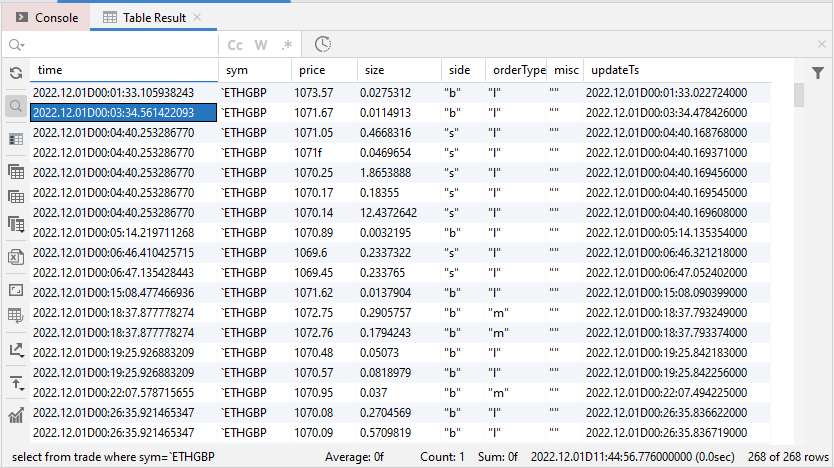

There you can see:

- **Main Toolbar** on the left side
- **Additional toolbar** on the right side
- **Status bar** at the bottom
- **Search bar** at the top (visible only if search is active)

The _Table Result_ view is used to show any table returned from an KDB instance as well as dictionaries or lists, if
enabled in [configuration](/settings/options).

## Selection

The _Table Result View_ is cell oriented table and even only one cell can be selected.

You can select range of cells:

- by dragging with left mouse button pressed
- by selecting the first cell and the last cell in the range with pressed _Shift_ button
- only subset of rows/columns by holding _Ctrl button_: 
  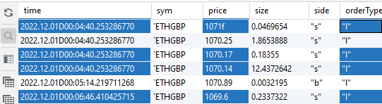

## Status Bar

StatusBase is located at the bottom of the _Table Result View_

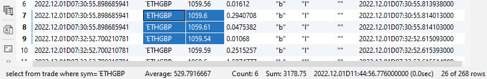

and shows in the following sequence:

- Executed query
- Average of all numeral cells in selection
- Total count of all selected cells
- Sum of all numeral cells in selection
- Time when the result has been received with (Roundtrip time for the query)
- Number of visible of total rows as some rows could be filtered out.

## Repeat Query

The _Table Result View_ has _Repeat the Query_ functionality available in

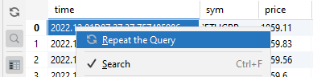

This functionality is available only if the _Table Result_ is related to KDB result from real instance. The button is
not available for imported or flipped tables, for exmaple.
{: .notice}

## Copy Values

### Quick Copy

There are some functionality that is not available though any menu but available in the _Table Result_:

- **double-click** on any cell does:
    - copy content of the cell
    - if value of the cell is a table, a dictionary or a vector and appropriate option is enabled
      in [configuration](/settings/options), open content of the cell in separate tab.

- **double-click + Alt** - opens content on a cell into main editor. This functionality can be useful if you have log
  text in the cell, like JSON message.

### Advanced Copy

You can also copy whole table or only selected cells with pop-up menu or appropriate buttons in the main toolbar:

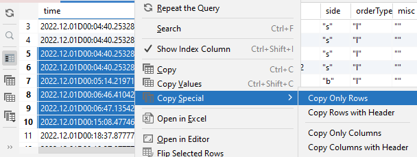

The table is copied in HTML format and can be pasted into any application that supports HTML formatting; otherwise its
copied as plain text.

You can copy select together with column names (by default) or without the header (with _Ctr+Shift+C_).

## Data Filtering

### Filter columns

In case if your result table has too many columns, it could be faster just hide some of them in the _Table Result_.
You can use columns filter button on the right side of the view to enabled it:

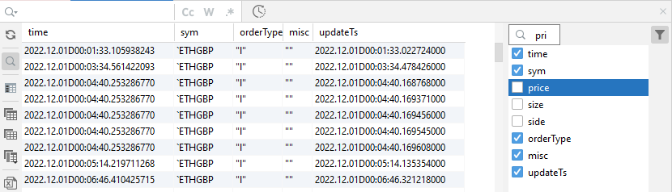

Start typing a column name for fast search it in the filter.
{: .notice--info}

### Filter Content

Like for columns filtering, instead of create new query to KDB you can do quick search in the _Table Result_. You can
enable it by _Ctrl+F_ or from main toolbar:

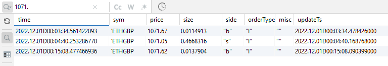

The entire table is searched and there is no possibility to specify which columns to use, but you can search matching
case, whole word or even by RegEx.

Search could be very expensive for big tables so 'Delay Search Update' functionality has been introduced that is enabled
for any table that has more than 200_000 cells.
'Delay Search' updates the table only after 300ms after last char has been entered. It allows to reduce UI freezes if
you enter a search keyword, for exmaple.
{: .notice}

## Exporting Data

### Open in Excel

You can do copy/paste into Excel but there is dedicated button and pop-up menu item to export selection or whole table
into Excel in native Excel format.

In this case the plugin tries to export data types as well, if it's possible.

### Export to File

You can also store the data into some other formats, like CSV or binary format:

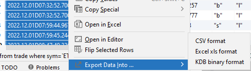

### Send to Instance

You can set the original data received from KDB Instance as is into another KDB Instance:

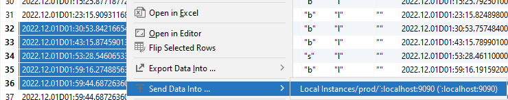

You must be connected to the instance before sending data.
{: .notice--info}

## Index Column

By default, only original data is shown in the table, but you can enable index column in the main toolbar:

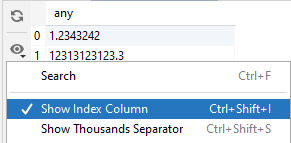

You can use index column for quick row or set of rows selection.
{: .notice--info}

You can enable Index Column by default in [configuration](/settings/options).
{: .notice--info}

## Transposing Rows

From time to time it may be useful to look at the data from a different angle.

Exactly in this case you can use 'Flip Selected Rows' that opens new tab and transpose selected rows into columns:

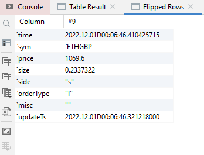

There a row #9 has been flipped into table where each column is a row now and row is a column.

The functionality can use useful if you have a table with many columns and would like to compare values of a few rows.