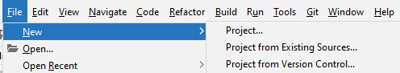
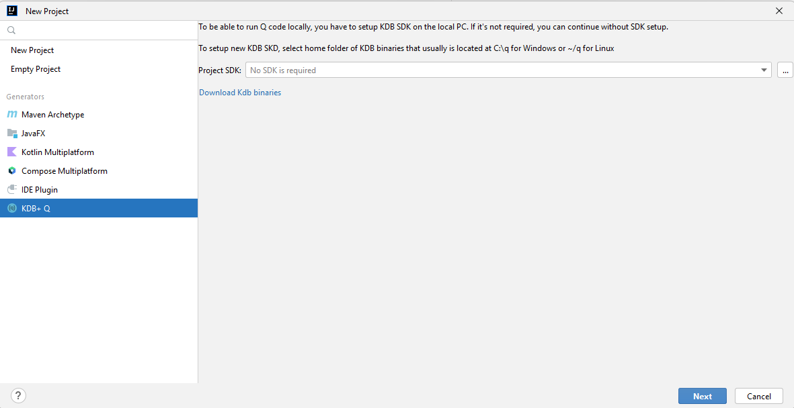
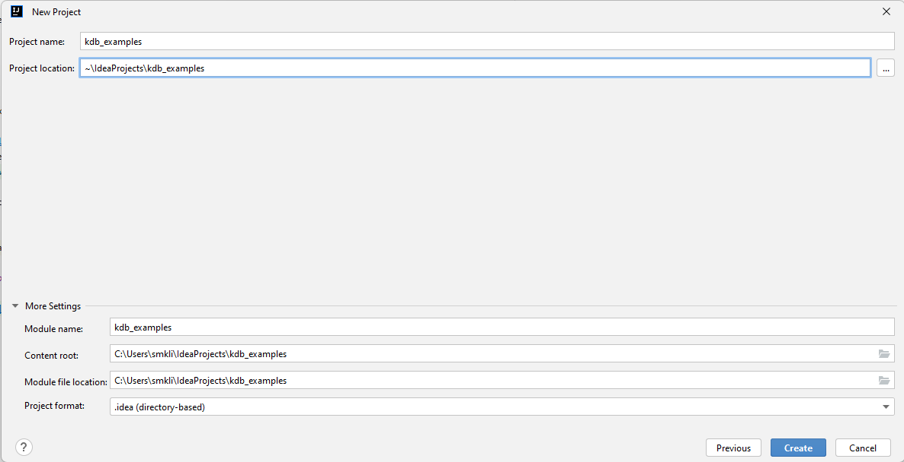

# Projects

JetBrains have excellent docs how to create new
projects: [https://www.jetbrains.com/help/idea/creating-and-managing-projects.html]().

Depends on what you already have, you
can [create new project](https://www.jetbrains.com/help/idea/new-project-wizard.html) or
[import project](https://www.jetbrains.com/help/idea/new-project-wizard.html) from exist sources or even get the project
from a source control system, like Git:

Just open 'File->New' menu and go through all steps

# Blank Project

## SDK Initialization

If you don't have any exist source code that you can use, you have to create new blank project.

If you have had [installed KdbInsideBrains plugin](/project/installation#plugin-installation) correctly, on this stage
you must see 'KDB+ Q' generator for new project:

There is only one part that you can initialize here - KDB+ Q SDK or binaries setup. It's required only if you'd like to
start local KDB process on local workstation for testing.

You can skip this step and add it later and go to the next step or please
check [how to set up KDB+ Q SDK](/project/sdk).

## Folders Initialization

At this step you can define where the project files will be located.The simplest way is just change the project name
that will update all dependant fields for you:

Your project must have at least one module that contains definition of source code configuration. By default, module
name equals to the project name but can be any. Please check JetBrains docs to get more info about
modules: [https://www.jetbrains.com/help/idea/creating-and-managing-modules.html]()

You also can find which project formats are the best for you in the official
docs: [https://www.jetbrains.com/help/idea/creating-and-managing-projects.html#project-formats]()

Your new project is ready! Please move to [Scopes & Instances definition](/features/scopes) to create your first
connection to real KDB instance and do simple query.

# From Exist Sources

TBD

# From Version Control

TBD