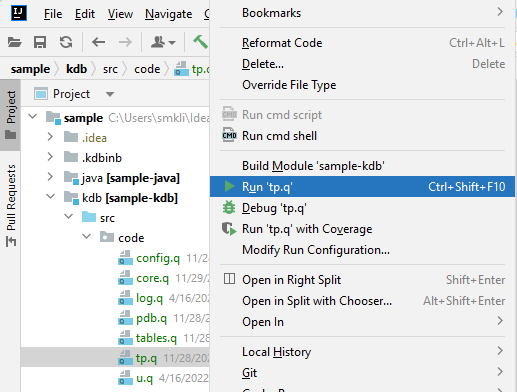
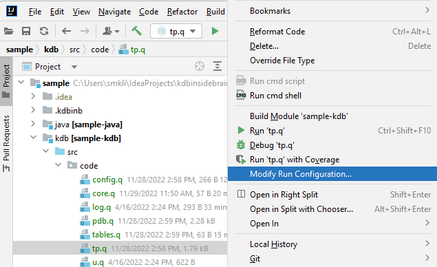
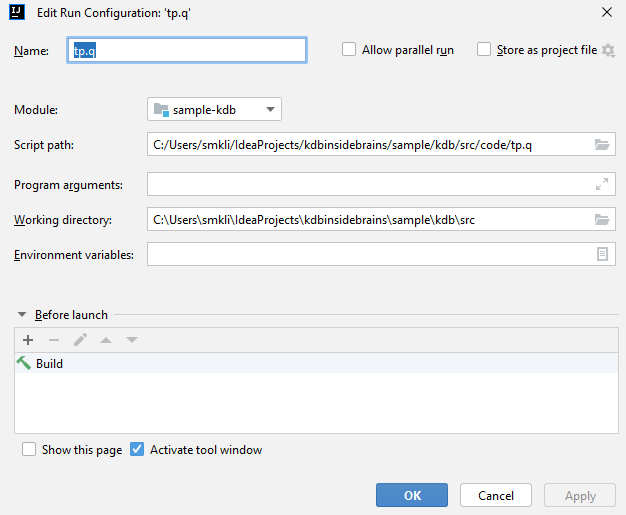
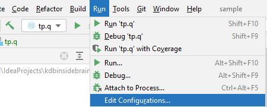

## New Local Process

One of features the IDEA and the plugin is to be able starting local KDB instance just by one click on a file.

You must set up correct [KDB SDK](/project/sdk) for your project or module.
{: .notice--info}

Just right-click on any Q file in the project tree and select 'Run <filename>' menu:

IDEA provides ability to run a process in _'Debug'_ mode or _'Run tests Coverage'_. For KDB process there is no
difference and any of the options just start local KDB instance.  
{: .notice}

Please make sure you have correct [module content is set up](/project/module#module-content) and source or content root
folder is set correctly.
{: .notice--info}

## Modify Run Configuration

When you start new process from the project tree, all required parameters are taken from module configuration and KDB
SDK, but you can change all of them or add more parameters with 'Modify Run Configuration':

and in opened dialog you can set:
- Name of the run (you can select the process by the name from 'Run' menu)
- Module that will be used as content and SDK source (the module must have KDB SDK as SDK)
- Script path, that is filled from running file
- Any process arguments, like _-p <port>_ or any other KDB parameters
- Working directory that will be used as the root for the file
- Environment variables

You can modify all these arguments later in Run/Debug Configuration dialog available from main menu:

{: .notice--info}
